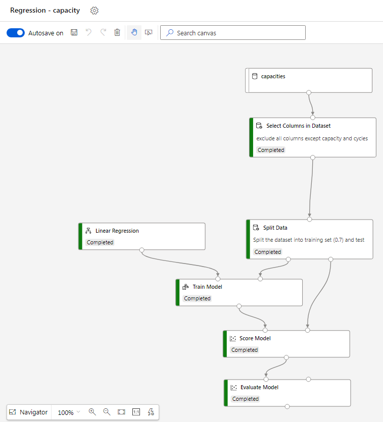

# azure-training-nasa-batteries

## Intro 
Use Nasa's [Li-ion Battery Aging Datasets](https://data.nasa.gov/dataset/Li-ion-Battery-Aging-Datasets/uj5r-zjdb) in order to practice Azure ML studio.

## create dataset and plot degradation
- The data preprocessed using a jupyter notebook
- Each battery saved in a separate parquet file
- the following plot shows the degradation of the batteries:

## Train linear regression model
- A linear regression model was trained with the Designer tool inside Azure ML Studio
- The dataset for this step was the parquet files which created in the previous step. Azure merged the parquet files automatically.
- **The RMSE of the model was 0.119452 [Ahr]**
- The diagram for the regression was the following:
