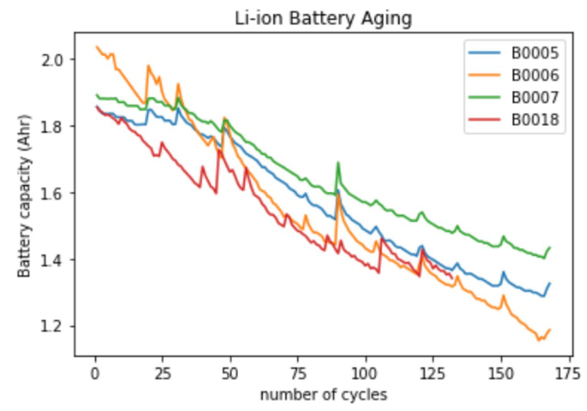

# azure-training-nasa-batteries

## Intro 
Use Nasa's [Li-ion Battery Aging Datasets](https://data.nasa.gov/dataset/Li-ion-Battery-Aging-Datasets/uj5r-zjdb) in order to practice Azure ML studio.

## create dataset and plot degradation
- The data preprocessed using a jupyter notebook
- Each battery saved in a separate parquet file
- the following plot shows the degradation of the batteries:

